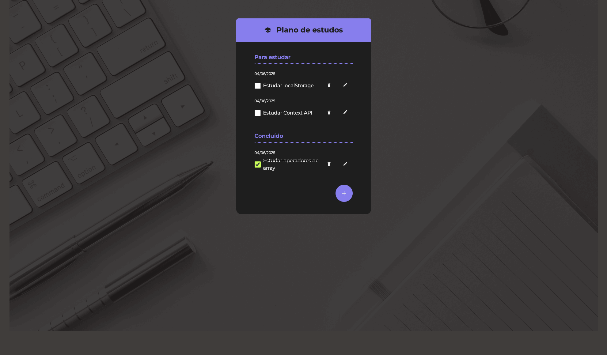
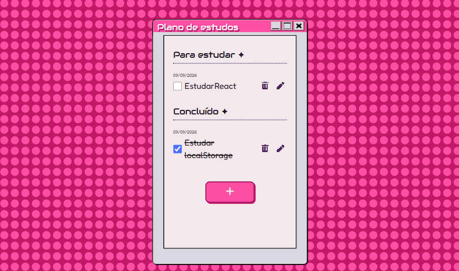

# Plano-de-Estudos-Y2K

Este projeto foi desenvolvido inicialmente a partir de uma aplicação proposta durante um curso da Alura.

## ✨ Sobre o projeto

A partir da estrutura original, realizei um redesign da interface, criando uma identidade visual inspirada em interfaces de computadores dos anos 2000.

O objetivo foi transformar o projeto de estudo em uma aplicação com mais personalidade, além de praticar conceitos de desenvolvimento Front-end, componentização e estilização com CSS.

## 🎨 Design

A identidade visual foi inspirada na estética **Y2K**, utilizando:

- 💗 Tons de rosa e roxo
- ⭐ Elementos decorativos inspirados nos anos 2000
- 🖥️ Janelas inspiradas em interfaces de sistemas operacionais antigos
- 🎀 Botões e componentes com aparência retrô
- ✨ Tipografia inspirada em interfaces digitais
- 🔘 Fundo desenvolvido com CSS utilizando `radial-gradient`

O layout e a identidade visual foram planejados no Figma antes da implementação no código.

## 🚀 Funcionalidades

- [x] Adicionar tarefas
- [x] Visualizar tarefas pendentes
- [x] Marcar tarefas como concluídas
- [x] Editar tarefas
- [x] Excluir tarefas
- [x] Modal para adicionar tarefas
- [x] Interface responsiva
- [x] Feedback visual nos elementos interativos

## 🛠️ Tecnologias utilizadas

- **React** — construção da interface e componentização
- **JavaScript** — lógica e interatividade da aplicação
- **HTML** — estrutura semântica da aplicação
- **CSS** — estilização, layout, responsividade e identidade visual

## 📚 O que pratiquei

Durante o desenvolvimento e redesign do projeto, pratiquei:

- Componentização com React
- Manipulação de estados
- Eventos e interações
- Criação e estilização de componentes
- CSS Flexbox
- Responsividade
- Pseudo-classes e estados de interação
- Variáveis CSS
- Criação de interfaces inspiradas em referências visuais
- Organização de estilos
- Acessibilidade
- Otimização de imagens e performance

## 🎯 Redesign

Uma das principais propostas deste projeto foi transformar a interface original em uma experiência visual completamente diferente.

### Antes

Interface original proposta no curso da Alura.

### Depois

Uma nova identidade visual inspirada na estética Y2K, com uma paleta de cores em rosa e roxo, elementos retrô e janelas inspiradas em softwares dos anos 2000.

## 📊 Lighthouse

O projeto foi analisado utilizando o Lighthouse:

| Categoria | Resultado |
|-----------|-----------|
| 🚀 Performance | 86 |
| ♿ Acessibilidade | 100 |
| ✅ Práticas recomendadas | 100 |
| 🔎 SEO | 83 |

A análise também ajudou a identificar oportunidades de otimização, incluindo a substituição do fundo baseado em imagem por um padrão criado diretamente com CSS.

## 💡 Aprendizados

Este projeto foi uma oportunidade para ir além da implementação proposta no curso e experimentar a criação de uma identidade visual própria.

O processo de redesign também me ajudou a entender melhor como decisões de UI, como cores, tipografia, espaçamento, contraste e elementos decorativos, influenciam a experiência do usuário.

## 👩‍💻 Desenvolvido por

**Vitória**

Projeto desenvolvido para fins de estudo e portfólio.
